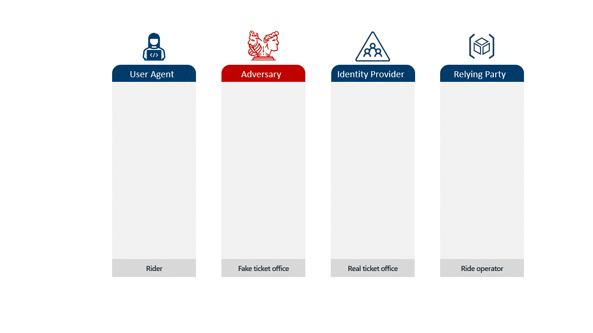
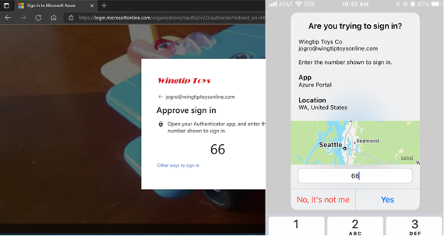

# Adversary-in-the-Middle フィッシング攻撃への対策

こんにちは、Azure Identity サポート チームの 五十嵐 です。

本記事は、2024 年 11 月 19 日に米国の Microsoft Entra (Azure AD) Blog で公開された [Defeating Adversary-in-the-Middle phishing attacks](https://techcommunity.microsoft.com/blog/identity/defeating-adversary-in-the-middle-phishing-attacks/1751777) の抄訳です。ご不明点等ございましたらサポート チームまでお問い合わせください。

----

## 増加する Adversary-in-the-Middle フィッシング攻撃のリスクを減らす方法

本日は ID に関連した高度な攻撃への対処に関する連載記事の第 2 回目をお届けします。

多要素認証 (MFA) を採用しているユーザーの割合が 40% を超えた今、傾向として 2 つの状況が浮かび上がってきています。1 つ目は、攻撃者が MFA で保護されていないアカウントの侵害に成功している割合が高くなっていることです。より多くのライオンがより少ない獲物を追いかけているような状況のため、ライオンの餌食となる獲物はより多くのリスクに直面しています。過去 1 年間で、当社は毎秒 7,000 件のパスワード攻撃をブロックしており、これは前年比で 75% 増加しました。2 つ目は、MFA の普及により、攻撃者は MFA で保護されたアカウントを侵害する別の方法を見つけることを余儀なくされていることです。このため、トークン窃取 ([前回のブログ](https://jpazureid.github.io/blog/azure-active-directory/how-to-break-the-token-theft-cyber-attack-chain/) のテーマ) や Adversary-in-the-Middle (AiTM) フィッシング攻撃 (今回のブログのテーマ) のような高度な攻撃が増加しており、このブログ シリーズではここに焦点を当てていきます。

ほとんどの攻撃には依然としてパスワードが関係しているため、何よりもまず、[パスワード関連の攻撃の 99% 以上を阻止できる](https://arxiv.org/abs/2305.00945) [MFA をオンにしましょう](https://learn.microsoft.com/ja-jp/entra/identity/authentication/tutorial-enable-azure-mfa)。MFA を計画的に展開し強制していくことは、あらゆる ID セキュリティの計画において最も重要な部分です。

最初のブログ「[トークン窃取によるサイバー攻撃の防止策](https://jpazureid.github.io/blog/azure-active-directory/how-to-break-the-token-theft-cyber-attack-chain/)」では、トークン窃取を伴う攻撃に対する 8 つの実践的な対策を紹介しました。トークン窃取とは異なり、AiTM フィッシング攻撃は、すでにユーザーに発行された有効なトークンを盗むわけではありません。それどころか、ユーザーを騙して正規の Web サイトにそっくりなページに誘導することで、ユーザーに認証情報を入力させ、MFA を実行するなど攻撃者に代わって認証を行わせます。これにより攻撃者は被害者の情報を使って本物の Web サイトにサインインすることで、攻撃者のデバイスに直接トークンが発行されるというものです。

このブログでは、AiTM フィッシング攻撃がどのように行われるのか、また AiTM フィッシング攻撃からユーザーを守るために何ができるのかについて説明していきます。

## 古典的なフィッシング攻撃の手口

上のアニメーション GIF は、このシリーズの [最初のブログ](https://jpazureid.github.io/blog/azure-active-directory/how-to-break-the-token-theft-cyber-attack-chain/) から転載したもので、ユーザー エージェント (デバイスまたはアプリケーション)、ID プロバイダー (IdP)、およびリライング パーティー間の通常のトークンの流れを示しています。ユーザー エージェントがアクセスを要求すると、IdP は ID を証明するよう要求します。ユーザー エージェントが認証情報を提供すると、IdP はトークンを返し、ユーザー エージェントはトークンをリライング パーティーに提示してリソースにアクセスできるようになります。ユーザー エージェントは、例えるなら遊園地で乗り物に乗るためのチケットを購入する来場者といえますし、IdP は遊園地の乗り物のチケットを販売するチケット売り場、リライング パーティーは来場者からチケットを確認して受け取り、乗り物に乗れるようにする係員のようなものです。

MFA が導入される以前は、下の図が示すように、フィッシング攻撃は容易に実行が可能でした。攻撃者 (右側) は、被害者 (左側) に対し、悪意のある偽のリンクを含んだそれっぽい欺瞞の電子メールまたはインスタント メッセージを送信します。例えば、「アカウントの確認を行う必要がある」もしくは「アクセス権を失わないよう緊急で対応する必要がある」などのように被害者に今すぐ行動をとるよう急かすような内容です。被害者となるユーザーがリンクをクリックすると、ユーザー名とパスワードの入力を求める偽サイトが表示されます。ユーザーがこれに応じると、偽サイトは認証情報を盗み取って、エラー メッセージや悪意のあるページを表示します。

このようなフィッシング攻撃では、攻撃者は正規のサイトやその IdP とやりとりする必要がないことに着目ください。パスワードを盗んだら、そのあとに攻撃者は正規のサイトにアクセスし、盗んだパスワードを使用していつでも好きなときに不正なサインインを行うことが可能です。

そこで MFA の登場です。

### MFA 登場後のフィッシング

従来の MFA の流れは、IdP がテキスト、電話、または認証アプリへのプッシュ通知を通じて直接ユーザーのデバイスまたはアプリケーションに通知した認証コードを、ユーザーが数分以内に入力する必要があるというものです。言い換えれば、MFA の通知は、フィッシング サイト経由でユーザーの認証情報を盗もうとする攻撃者を迂回して行われます。ユーザーがサインイン画面を操作していなくても MFA が試行される可能性はあるため、ユーザーがゴルフに出かけているにもかかわらず、要求した覚えのない MFA 通知 (テキストや電話) を受け取るという場合があり得ます。この場合、盗んだパスワードで「いつでも好きな時に」不正なサインインをするという従来の攻撃を試みる攻撃者は困ったことになります。ユーザーの応答がない場合、攻撃が失敗するからです。

MFA を迂回するためには、攻撃者は攻撃の流れを変える必要があります。MFA の一連の流れの間、被害者となるユーザーを継続的にその流れに巻き込み続けなければなりません。そのためには、被害者と IdP で行われる認証のやり取りのその中間に攻撃者が挟まるようにし、流れの一方では被害者と攻撃者が、もう一方では攻撃者と IdP が直接やり取りするようにします。このようにして、攻撃者は被害者を操り、ユーザー名、パスワード、および検証コードを提供させるのです。そうすれば認証の一連の流れが成立しますので、攻撃者は被害者のアカウントにアクセスできるようになります。

この双方向のやりとりの間、攻撃者は被害者に対してはサインイン画面になりすまし、IdP に対しては被害者になりすますということを行います。攻撃者は正規の IdP の UI をスクレイピングして被害者に提示し、被害者が IdP へ資格情報を提示したら攻撃者はそれをキャプチャして、正規の IdP に提示します。

フィッシング サイトに誘導された被害者は、偽のサインイン画面とやり取りします。攻撃者はそのやり取りをキャプチャし、正規の IdP に伝えます。正規の IdP が MFA チャレンジを発行すると、被害者は偽サイトに表示された偽の MFA 通知とやり取りしてそれに応答します。攻撃者は被害者の応答をキャプチャし、正規の IdP にそれを横流しして認証の一連の流れを完成させます。IdP は攻撃者に対して有効なトークンを発行し、攻撃者は被害者のアカウントへの侵入に成功します。

前回のブログでは、トークンの窃取を遊園地のチケット売り場でチケットを購入した後にスリに遭うことに例えました。AiTM フィッシングは、騙されて間違ったチケット売り場に行かされるようなものと言えるでしょう。

入場料が 10% 割引になるというチラシに惹かれたあなた (ユーザー エージェント) は、正規にみえるチケット売り場に行き、シーズン パス (トークン) の購入を依頼します。偽の係員 (攻撃者) はあなたの ID とクレジット カードを要求します。あなたがそれらを渡すと、係員はそれらを共犯者に渡し、共犯者は正規のチケット売り場 (IdP) に走り、あなたの ID とクレジット カードを使ってパスを購入しようとします。

クレジット カードでの取引を承認するにあたり、カード会社があなたに SMS で PIN コードを送ります。正規のチケット売り場はそれをカード会社に提示することが求められます。チケット売り場がコードを要求すると、共犯者が偽のチケット売り場に戻ってあなたから PIN コードを受け取り、正規の売り場に戻ってその PIN で購入を完了し、シーズン パスをポケットに入れます。このように走り回るような例だとかなり面倒に思うかもしれませんが、デジタルなやりとりではすべてが即座に行われますので、正規のユーザーがこれを見破るのはかなりの困難を伴うということを覚えておいてください。

共犯者があなたの ID とクレジット カードを持って戻ってくると、偽の係員はそれをあなたに返し、クレジット カードでの取引ができなかったと言うのです。残念ですが、あなたが支払ったシーズン パスをあなた以外のだれかが乗り物の係員 (リライング パーティー) に提示し、その人が乗り物を楽しむということになります。

適切なポリシーを構成して MFA を実施することで、攻撃者が認証情報を盗んだとしても、好きなときに何度も認証を完了するということはほぼ不可能になりますが、攻撃者はこの AiTM フィッシングの手法を使ってトークンを取得し、少なくともそのトークンの有効期限が切れるまでは何らかの危害を加えることができます。

MFA をバイパスする攻撃の詳細については、ブログ ポスト「[君達の資格情報は全ていただいた！](https://jpazureid.github.io/blog/azure-active-directory/all-your-creds-are-belong-to-us/)」を参照ください。

続いて、Microsoft がこれらの攻撃にどのように対応しているのか見ていきましょう。まず、最も確実な対策であるパスキーから始め、その他の多層防御のオプションについて説明します。

## パスキーは AiTM フィッシング攻撃に対する最善のソリューション

トークン保護の機能がトークン窃取攻撃を防ぐ決定的な方法であるのと同様に、新しい種類の資格情報を用いることでユーザーが AiTM フィッシング攻撃の餌食になることをほぼ防ぐことが可能です。フィッシングに耐性のある資格情報は、機密情報を公開しない暗号的な手法を使用しているため、攻撃者が認証プロセスを傍受したり複製したりすることができず、より安全です。[Microsoft Entra ID がサポートする認証方法](https://learn.microsoft.com/ja-jp/entra/identity/authentication/concept-authentication-methods) のうち、パスキー、証明書ベース認証 (CBA)、および Windows Hello for Business はフィッシング耐性があります。最も強い保護を提供することで、[米国のサイバーセキュリティ向上に関する大統領令](https://www.microsoft.com/en-us/security/blog/2024/08/26/how-microsoft-entra-id-supports-us-government-agencies-in-meeting-identity-security-requirements/?msockid=19c63df6c7b66c801d3c29f1c69b6d43) などの規制要件を満たしています。

最新の業界標準であるパスキーはすでに採用が広がっています。高いセキュリティ保証を提供するため、パスキーは [公開鍵暗号方式](https://learn.microsoft.com/ja-jp/windows/win32/seccertenroll/public-key-infrastructure) を使用し、ユーザーとの直接のやり取りを必要とします。以下のような 3 つの重要な特性により、パスキーのフィッシングはほぼ不可能と言えます:

- **URL 固有**: ユーザー エージェントがパスキーを作成するとき、プロビジョニングのプロセスにおいてリライング パーティーの URL を記録し、パスキーは同じ URL のサイトに対してのみ機能します。このため偽の模倣サイトでは機能しません。
- **デバイス固有**: ユーザーがアクセスを要求しているデバイスにパスキーが同期、保存、または接続されている場合に限り、リライング パーティーにアクセスが許可されます。
- **ユーザー固有**: 認証を完了するために、ユーザーは通常は、顔、指紋、またはデバイス固有の PIN を使用してデバイス上で何らかの身体的操作を行うことによって、ユーザーが物理的に存在することを証明する必要があります。

パスキーは、目に見えないインクで書かれた特別な ID カードのようなもので、意図された場所で、本人が提示した場合にのみ明らかにすることができます。この場合、この特別な ID カードは、遊園地の正規のチケット売り場で、生体認証または PIN を使ってロックを解除したときにのみ機能します。

Microsoft Entra ID のフィッシングに強い認証方法については、[ビデオ シリーズ](https://learn.microsoft.com/ja-jp/entra/identity/authentication/phishing-resistant-authentication-videos) をご覧ください。

## Adversary-in-the-Middle 攻撃に対する多層防御策

AiTM 攻撃は、フィッシングに耐性のある認証情報でサインインするユーザーに対しては効果がありませんが、フィッシングに耐性のある認証情報をすべてのユーザーに展開するには時間がかかります。OATH トークンや単純な承認による MFA を使用している場合でも、攻撃者が AiTM 攻撃を実行するのをはるかに困難にする追加の安全策を設定することが可能です。

## パスワードレス化

MFA およびパスワードレス認証に Microsoft Authenticator アプリをご使用ください。Authenticator アプリは、MFA の要求が正当なものか、潜在的なセキュリティ脅威であるかをユーザーが判断できるように、追加の情報を提供します。 

- **アプリケーション名**: 認証を要求しているアプリケーションの名前を表示することで、その MFA 要求がユーザーのアクセス先リソースからのものであるかどうかを認識できます。
- **地理的な場所**: IP アドレスに基づいてサインインを試行した場所を表示することで、予期しない場所や疑わしい場所からのサインインを識別しやすくなります。
- **番号の一致**: Authenticator アプリに入力する必要がある番号をサインイン画面に表示することで、ユーザーが物理的に存在し、サインインの試行を意識して行っていることを確認します。

「No, it's not me」の選択肢を押したユーザーは、Entra ID Protection にリスク シグナルとして情報が送信され、リスク ポリシーによりユーザーに即座に何らかの対応を求めることが可能です。さらに、当社の ID セキュリティ アルゴリズムが、異常な IP アドレスや既知の悪質な IP アドレスからのサインイン試行を検出した場合は、MFA 通知も抑制されます。

Microsoft Authenticator を使用したパスワードレス認証の設定方法については、[ドキュメント](https://learn.microsoft.com/ja-jp/entra/identity/authentication/howto-authentication-passwordless-phone) を参照ください。

## 攻撃者の活動を制限するアクセス ポリシーの設定

AiTM 攻撃はユーザーを騙して悪質な Web サイトに誘導することが必要なため、ユーザーがそういったサイトに誘導されないようにできるだけ多くのバリケードを設ける必要があります。例えば、ポリシーによる制限を設けることで、攻撃者は活動が制限され、攻撃者の移動範囲を大幅に制限するとともに攻撃者の活動を特定してブロックすることも容易になります。

### マネージドおよび準拠済みデバイスを要求する

Microsoft Entra ID のポリシーで、マネージドおよび準拠済みデバイスを使用しているユーザーにのみトークンを発行するという構成にしていた場合はどうなるでしょう。攻撃者がユーザーに代わってトークンを要求するには、まずユーザーが使用するマネージドおよび準拠済みデバイス上にフィッシング サイトを構成し、デバイスの電源は常にオンにした状態でエンドポイント保護も回避する必要があります。さらには発行されたトークンをポリシーで指定された更新期間内に使用しながら、トークンの自動失効につながるリスクのしきい値はトリガーしないようにするということも必要です。これらのハードルはかなり高いと言えるでしょう。

攻撃者が AiTM フィッシング攻撃を仕掛けるにあたり使用するマルウェアへの感染を防ぐには、ポリシーを構成してすべてのデバイスを準拠済みとすること、最新のエンドポイント保護を実行していること、そしてすべての Windows ユーザーがデバイスの管理者権限ではなく標準ユーザーとして実行されていることを強制ください。

管理対象デバイスを要求するポリシーの構成方法については、[ドキュメント](https://learn.microsoft.com/ja-jp/mem/intune/protect/device-compliance-get-started#compliance-policy-settings) を参照ください。

### ネットワーク境界内で使用されるセッションを制限する

条件付きアクセスを使用して、IP アドレス範囲を使用して準拠済みネットワークの境界を定義できます。ネットワーク境界を確立すると、ネットワーク境界外のデバイスへのトークンの発行や再発行ができなくなるため、攻撃者はその境界内で活動することを余儀なくされます。そのため、攻撃者は管理された準拠デバイス上でユーザー応答を不正利用する必要があるだけでなく、そのデバイスもネットワーク境界内で動作している必要があります。

Entra Internet Access と Entra Private access では、エンドポイントにエージェントをインストールし、アクセスを要求するユーザーが信頼できるネットワークから来たかどうかを確認するリアルタイムの準拠ネットワーク チェックが実施されます。もしネットワーク境界内にいなければ、条件付きアクセスは即座にリクエストを拒否します。 

条件付きアクセスを使用して準拠ネットワークの境界を定義するための詳細な手順は、こちらの [ドキュメント](https://learn.microsoft.com/ja-jp/entra/identity/conditional-access/policy-block-by-location) を参照ください。

また、条件付きアクセスを使用して準拠ネットワークのチェックを有効にするための詳細な手順は、こちらの [ドキュメント](https://learn.microsoft.com/ja-jp/entra/global-secure-access/how-to-compliant-network) を参照ください。

### ユーザーがアクセスできる URL を制限する

ユーザーがフィッシング リンクをクリックすると、Windows と Microsoft Edge に統合されたセキュリティ機能である [Microsoft Defender SmartScreen](https://learn.microsoft.com/ja-jp/windows/security/operating-system-security/virus-and-threat-protection/microsoft-defender-smartscreen/) が、ユーザーおよび業界から報告されているフィッシング サイトやマルウェア サイトの動的リストとその URL を照合します。一致するサイトが見つかった場合、そのサイトが安全でないと報告されていることをユーザーに警告し、そのサイトに進むには追加の手順を踏む必要が生じます。SmartScreen はまた、ダウンロードされたファイルやアプリケーションをスキャンし、悪意のあるファイルや望ましくない可能性のあるファイルをブロックします。

Microsoft Defender for Endpoint のネットワーク保護は、SmartScreen の適用範囲を拡大し、信頼性の低い Web サイトに接続しようとするすべての外向きの HTTP(S) トラフィックを OS レベルでブロックします。ネットワーク保護を有効にするには、Intune、PowerShell、グループ ポリシー、または Microsoft Configuration Manager を使用いただけます。また、Microsoft Defender for Office 365 ポータルのテナント許可/ブロック リストを構成して、ユーザーがアクセスできるサイトを制限することもできます。

Microsoft Defender を使用して URL をブロックする方法については、こちらの [ドキュメント](https://learn.microsoft.com/ja-jp/defender-office-365/tenant-allow-block-list-urls-configure) を参照ください。

また、Microsoft Defender for Endpoint のネットワーク保護を有効にする方法については、こちらの [ドキュメント](https://learn.microsoft.com/ja-jp/defender-endpoint/enable-network-protection) を参照ください。

## フィッシング攻撃を示す異常を検出し対応するよう備える

万が一、上記すべての対策が失敗した場合も、異常検知の機能で攻撃のブロックと修復が可能です。

### Microsoft Entra ID Protection と Microsoft Defender を使用して、異常なセッションを監視

ユーザーがセッションを開始したり、アプリケーションにアクセスしようとすると、Microsoft Entra ID Protection はユーザーとセッションのリスク要因に通常と異なる (異常な) 要素がないかを調べます。以下は、リスク レベルを高める異常の例です:

- 通常とは異なる Web サイトからのトークン要求
- 攻撃者がフィッシングで入手したトークンでサインイン (次のような [検出](https://learn.microsoft.com/ja-jp/entra/id-protection/concept-identity-protection-risks#risk-detections-mapped-to-riskeventtype) がトリガーされます):
  - 異常なトークン 
  - 異常なユーザー アクティビティ 
  - Attacker in the Middle
  - 見慣れないサインイン プロパティ  
  - ユーザーからの疑わしいアクティビティ (自分が開始していない MFA リクエストなど) の報告

条件付きアクセスポリシーを構成すると、リスクに基づく対応が可能です。ユーザーまたはセッションのリスクレベルが上昇したときに、自動的に実行される修復ステップを定義できます。

リスク検出の詳細については、こちらの [ドキュメント](https://learn.microsoft.com/ja-jp/entra/id-protection/concept-identity-protection-risks#risk-detections-mapped-to-riskeventtype) を参照ください。

### リスク ベースの条件付きアクセス ポリシーを作成する

例えば、リスクが高まった場合に MFA による [再認証を要求する](https://jpazureid.github.io/blog/azure-active-directory/prompt-users-for-reauthentication-on-sensitive-apps-and-high-risk-actions-with-conditional-access/) ような条件付きアクセス ポリシーを構成することができます。この場合、正当なユーザーはその場にいないことが多く、攻撃者とやり取りして再認証の手助けをしてしまうということが起きないので、AiTM フィッシング攻撃を阻止できます。条件付きアクセスは通常、トークンの更新時にリスク レベルをチェックするため、攻撃者がなんとか正規のトークンを手に入れたとしても、攻撃を受けるのはそのトークンの有効期間内に限られます。

継続的アクセス評価 (CAE) は、Teams、Exchange Online、SharePoint Online などのアプリケーションやサービスでネイティブにサポートされており、これらのアプリケーション用のアクセス トークンをリアルタイムで無効にできます。この発動条件には、ユーザーのネットワークの場所の変更も含まれます。

リスク ベースの条件付きアクセス ポリシーを作成する詳細な手順については、こちらの [ドキュメント](https://learn.microsoft.com/ja-jp/entra/id-protection/concept-identity-protection-policies) を参照ください。

CAE を使用した厳密なロケーション ポリシーを適用する詳細な手順については、こちらの [ドキュメント](https://learn.microsoft.com/ja-jp/entra/identity/conditional-access/concept-continuous-access-evaluation-strict-enforcement) も参照ください。

### Microsoft Defender XDR を使用して、AiTM フィッシング攻撃を調査および軽減する

攻撃者が資格情報とセッション Cookie の傍受に成功した場合、攻撃者はそれらを使用してビジネス E メール詐欺 (BEC) や認証情報の収集などの他の攻撃を開始することが一般的です。AiTM フィッシング攻撃を示す複数の Microsoft 365 Defender シグナルが検知されると、Defender XDR は侵害されたユーザー アカウントを自動的に Entra およびオンプレミスの Active Directory で無効にし、セッション Cookie も無効化します。また、セッション トラフィックを監視し、攻撃者が機密データをネットワーク外に持ち出すことを防ぐようポリシーを適用します。

Defender XDR を使用して AiTM フィッシング攻撃を阻止する詳細な手順については、ブログ記事 [Automatically disrupt adversary-in-the-middle (AiTM) attacks with XDR](https://techcommunity.microsoft.com/blog/microsoftthreatprotectionblog/automatically-disrupt-adversary-in-the-middle-aitm-attacks-with-xdr/3821751) をご覧ください。

### Microsoft Sentinel などのセキュリティ情報およびイベント管理 (SIEM) ツールを使用して潜在的な AiTM フィッシング攻撃の可能性を調査する

AiTM フィッシング攻撃の可能性を示すイベントのアラートを受信した場合、Microsoft Sentinel ポータルまたは他の SIEM で調査することが可能です。Microsoft Sentinel は特定のインシデントについて、その重大度、発生時期、関与したエンティティの数、トリガーとなったイベントなどの重要な詳細を提供します。その後、調査マップを表示して、潜在的なセキュリティ脅威の範囲と根本原因を確認できます。

Sentinel を使用してインシデントを検出および調査するための詳細な手順については、ブログ記事 [Identifying Adversary-in-the-Middle (AiTM) Phishing Attacks through 3rd-Party Network Detection](https://techcommunity.microsoft.com/blog/microsoftsentinelblog/identifying-adversary-in-the-middle-aitm-phishing-attacks-through-3rd-party-netw/3991358) を参照ください。

| 可能な限りパスキーを使用してパスワードレス化 | 攻撃者の活動を制限するアクセス ポリシーの設定  | フィッシング攻撃を示す異常を検出し対応に備える |
| ------------- | ------------- | ------------- |
| [MFA およびパスワードレス認証には、Microsoft Authenticator アプリを使用します](https://learn.microsoft.com/ja-jp/entra/identity/authentication/howto-authentication-passwordless-phone) | [管理済みおよび準拠済みデバイスを要求する](https://learn.microsoft.com/ja-jp/mem/intune/protect/device-compliance-get-started#compliance-policy-settings) | [Microsoft Entra ID Protection と Microsoft Defender を使用して、異常なセッションを監視する](https://learn.microsoft.com/ja-jp/entra/id-protection/concept-identity-protection-risks#risk-detections-mapped-to-riskeventtype) |
|  | [ネットワーク境界内で使用するセッションを制限する](https://learn.microsoft.com/ja-jp/entra/identity/conditional-access/policy-block-by-location) | [リスク ベースの条件付きアクセス ポリシーを作成する](https://learn.microsoft.com/ja-jp/entra/id-protection/concept-identity-protection-policies) |
|  | [ユーザーがアクセスできる URL を制限する](https://learn.microsoft.com/ja-jp/defender-office-365/tenant-allow-block-list-urls-configure) | [Microsoft Defender XDR を使用して、AiTM フィッシング攻撃を調査し、軽減する](https://techcommunity.microsoft.com/blog/microsoftthreatprotectionblog/automatically-disrupt-adversary-in-the-middle-aitm-attacks-with-xdr/3821751) |
|  |  | [Microsoft Sentinel などの SIEM を使用して潜在的な AiTM フィッシング攻撃の可能性を調査する](https://learn.microsoft.com/ja-jp/azure/sentinel/investigate-incidents#investigate-your-incident-in-depth) |

当社の検出データによると、AiTM フィッシング攻撃は過去 1 年間で 146 % 増加しています。パスキーはこれらの攻撃に対して最も効果的なソリューションであるため、今すぐパスキーの導入を計画し、実行に移すことを強くお勧めします。それまでの間に、このブログで紹介しているその他の多層防御の推奨事項を取り入れ、ユーザーを可能な限り安全に保つこともご検討ください。

安全にお過ごしください！  
Alex Weinert
