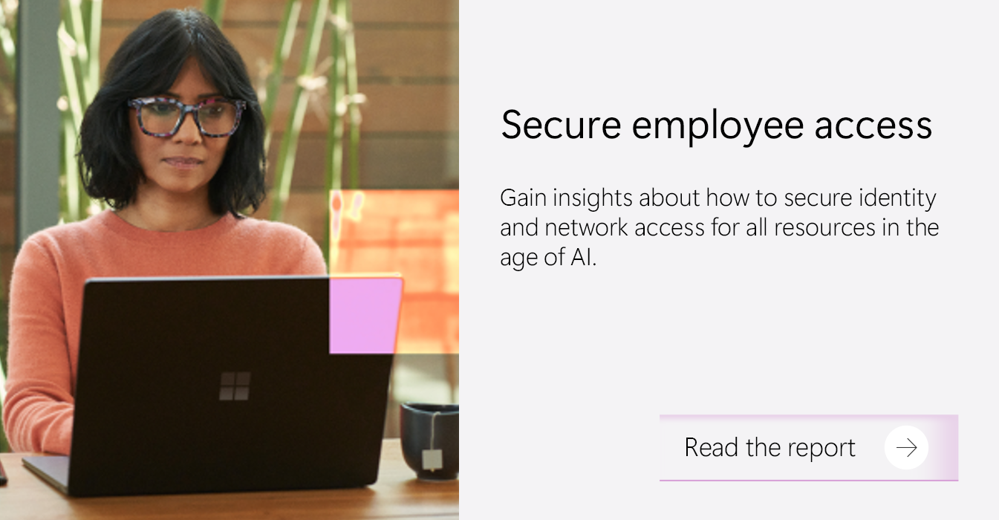
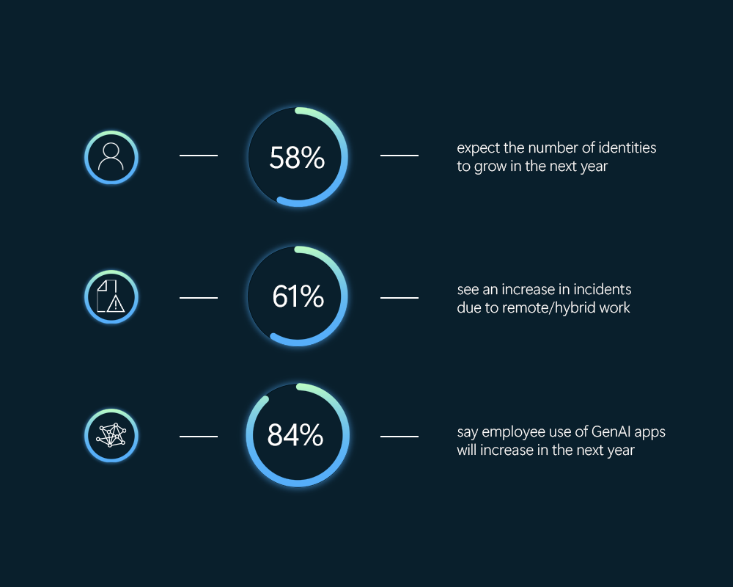
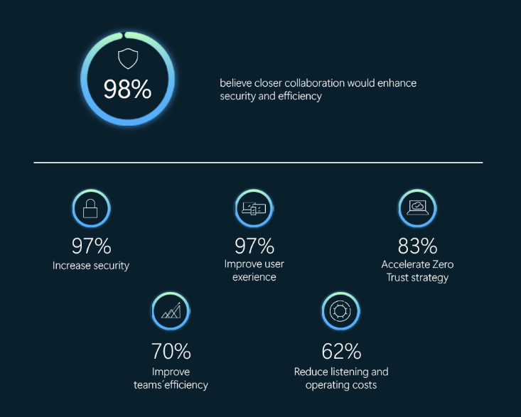

# Secure Employee Access レポートが示すセキュアな統合アクセスの必要性

こんにちは、Azure Identity サポート チームの 山下 です。

本記事は、2025 年 3 月 24 日に米国の Microsoft Entra (Azure AD) Blog で公開された [Insights from the Secure Employee Access report reveal the need for unified access security](https://techcommunity.microsoft.com/blog/microsoft-entra-blog/insights-from-the-secure-employee-access-report-reveal-the-need-for-unified-acce/2520425)を意訳したものになります。ご不明点等ございましたらサポート チームまでお問い合わせください。

---

従来の、各分野に特化した個別のセキュリティ対策は、従業員のアクセスを守る方法として、もはや効果を発揮しなくなりました。実際、98 % のセキュリティ責任者が、ID とネットワークの密な連携がセキュリティや業務効率を向上させるうえで重要と考えています。これは、[Secure Employee Access in the Age of AI report](https://cdn-dynmedia-1.microsoft.com/is/content/microsoftcorp/microsoft/final/en-us/microsoft-brand/documents/639917-secure-employee-access-report-2025-final.pdf) から明らかになった調査結果のひとつに過ぎません。このレポートは、300 人のセキュリティ責任者に対して、セキュリティ戦略や投資がどのように新しいセキュリティ課題を解決し、安全な AI 変革を可能にしたかを調査したものです。このレポートでは、組織内の ID 管理、およびアプリケーションやリソースへのアクセス保護の方法を見直すために必要な統計と知見がまとめられています。

特に重要な知見は以下のとおりです: 

1. 現代の職場環境はますます複雑化しており、新たなセキュリティ課題が生じている。
2. 攻撃対象の範囲が拡大しており、個別管理されている ID やネットワーク アクセスの利用を続けることで、セキュリティ責任者の負担が大きくなる。
3. ID とネットワーク担当チームが密に連携することで、より高いセキュリティ効果と作業効率がもたらされる。

## 現代の職場環境の複雑さ

企業がクラウド導入、ハイブリッドワーク、AIアプリケーションを採用するにつれて、セキュリティの状況は急速に変化しています。この変化によって、セキュリティ チームが従業員のアクセスを保護し、リスクを軽減するために対処しなければならない 3 つの主な課題がもたらされました。

1. 現在のセキュリティの担当者は、これまで以上に多くの ID 情報とアプリケーションが存在し、しかも拡大し続ける IT 環境を管理しています。従業員はビジネスに不可欠なアプリへのシームレスなアクセスを必要としている一方で、セキュリティ責任者はそれについていくのがやっとという状況です。さらに、58 % のセキュリティ責任者は、来年には ID 情報の数がさらに増加すると予想しており、従業員のアクセス ライフサイクルと最小特権を実現することが最優先事項となっています。適切な管理がなされなければ、管理から漏れた ID 情報が不正アクセスやセキュリティの抜け漏れのリスクを増大させることになります。

2. ハイブリッド ワークにより、セキュリティ対策は常に見直しが必要となっています。従業員は、クラウドとオンプレミスの環境を定期的に切り替えるため、アクセスパターンは一貫せず、新しい攻撃ベクトルを生み出しています。その結果、61 % のセキュリティ責任者がハイブリッドワークモデルに起因したセキュリティ インシデント ( ID およびネットワークに関連) の増加を報告しています。従来の境界型のセキュリティ モデルでは、各所に散らばった従業員からのアクセスを保護する複雑さに対処できません。

3. AI の採用は加速しており、従業員の生産性を向上させる一方で、新しい種類のサイバー脅威も生み出しています。セキュリティ専門家は、AI アプリケーションへのアクセスを保護する必要があると認識していますが、明確な戦略がない状況です。57 % のセキュリティ責任者が AI の使用によるセキュリティ インシデントの増加を報告しており、AI ツールに対して強力なアクセス制御を実装する必要性が明らかになっています。AI がワークフローに統合されるにつれて、これらのアプリケーションへのアクセスを保護することが、機密データを保護し、新たな脅威を軽減するために重要になります。実際、61 % の組織が、生成 AI への JIT (ジャスト イン タイム アクセス) アクセスを実装しようとすでに取り組みを始めています。

これからは、アクセスの保護に対して、統合され、プロアクティブでスケーラブルなアプローチをとることが必要です。つまり、日々進化する脅威からより強力に組織を防衛をするため、ID とネットワークアクセス制御を統合したアプローチが必要なのです。

## 攻撃対象範囲の拡大とツールの増加

攻撃対象範囲が拡大し続ける中で、セキュリティ担当チームは、ますます多くの ID 管理およびネットワーク セキュリティのソリューションに対応する必要性が生じています。これらのツールは、緊急性の高い問題を解決するのには役に立ちますが、複数のチームにより特段の考慮もなく選定され運用されることが多い状況です。理由は簡単で、より多くのツールや最新のツールを採用することで、より良いセキュリティ効果が得られるからです。しかし、研究によると、このアプローチは逆効果を招くことが報告されています。複雑さが増し、やり取りやコラボレーションが断片化することでより非効率になり、さらには侵害リスクも高まる可能性があります。概ね 4 つの異なるチームが従業員の ID とネットワーク管理、およびセキュリティを担当している場合、全体像を把握するのが難しくなると想像できます。

複数のベンダーが提供する複数のソリューションを管理することになると、運用においても困難さが増してきます。組織は、平均して 3 つのベンダーから 5 つの ID 管理ソリューションを使用しており、別の 3 つのベンダーから 4 つのネットワーク ソリューションを使用しているという統計データがあります。このように複数のベンダーからのツールが混在していると、セキュリティ対策がバラバラなものとなり、一貫したポリシーの適用や脅威の検出、インシデント対応の最適化が困難になります。加えて、セキュリティ対策を強化するどころか、6 つ以上の ID 管理およびネットワーク ソリューションを抱える組織では、深刻な侵害が 79 % も増加しているとが示されています。一方で、5 つ以下のソリューションを持つ組織では、45 % の増加にとどまります。

より多くのツールを使用することが必ずしも良いセキュリティ対策を意味するわけでははいことは、データを見れば明らかです。むしろ、より少ないツールを利用する組織の方がセキュリティ侵害や影響が少ないといえます。アクセス管理をよりシンプルに統一するよう取り組むことで、組織はリスクを軽減し、運用効率を向上し、セキュリティ担当チームと従業員にとってより良いユーザー体験を提供することができると言えます。

## ID とネットワークの分断を打破する

ID チームとネットワーク チームの協力が不可欠になってきます。これらの機能が独立して運用されると、ポリシーが適切に構成されず、可視性も落ち、運用も非効率になります。ID の層とネットワークの層の両方を標的とする脅威が存在する中で、各チームの連携が取れていないと、アクセス ポリシーと制御に隙間が生まれ、対応の遅れやリスクの増大、全体的にセキュリティ体制が弱くなる恐れが生じます。進化する脅威に対応するために、セキュリティ責任者はより統合された連携の取れたアクセス セキュリティ戦略を構築する必要があります。

調査によると、セキュリティ専門家の約 98 % が、より緊密な連携によりセキュリティと組織の効率が向上すると考えています。さらに、96 % のセキュリティ専門家が ID 管理とネットワーク アクセス管理に対して、独立したソリューションではなく包括的で統合されたアプローチを好むと述べています。

セキュリティの専門家も、統合により大きな恩恵が得られると述べています: セキュリティ責任者の 97% が、統合によりセキュリティの向上とユーザー体験の改善が得られると考えており、83 % がゼロ トラスト戦略をより加速させると述べています。

## AI の時代におけるセキュアな従業員アクセスに向けて

セキュリティの状況は急速に変化しており、ID 管理とネットワーク管理に関して断片的でサイロ化されたアプローチを超え、従業員のセキュアなアクセスを再考する時がきています。統一された手法を構築することが、防御や業務効率、ユーザー体験を強化する鍵となります。

セキュリティ責任者が、より強固なアクセス戦略を構築するために積極的に取るべき重要な次のステップは以下のとおりです:

- ユーザー、デバイス、アプリケーション全体で一貫したセキュリティ ポリシーを確立するために、ID 管理とネットワーク アクセス制御を統一する。
- 情報連携とリスクの軽減を改善するために、ID チームとネットワーク チーム間の連携を促進する。
- セキュリティ ソリューションを統合し、ツールの乱立を最小限に抑え、運用を最適化することで複雑さを減らす。
- 生産性向上のために AI アプリケーションへのアクセスを確保しつつ、強固なセキュリティとのバランスをとる。

AI の時代において従業員によるアクセスをより安全にするにあたり、よりシンプルな構成をとること、製品を統合すること、連携を深めることが重要なのは明らかです。より深い知見と事業戦略に関わる推奨事項については、こちらの [レポート全文](https://cdn-dynmedia-1.microsoft.com/is/content/microsoftcorp/microsoft/final/en-us/microsoft-brand/documents/639917-secure-employee-access-report-2025-final.pdf)をお読みください。より詳細を確認したい場合は、[図で表したデータ](https://cdn-dynmedia-1.microsoft.com/is/content/microsoftcorp/microsoft/final/en-us/microsoft-brand/documents/secure-employee-access-in-the-age-of-ai-infographic.pdf) についてもご覧ください。

Irina Nechaeva, General Manager Identity and Network Access
