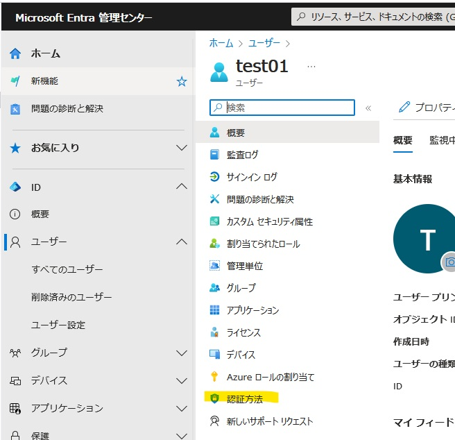
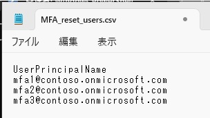
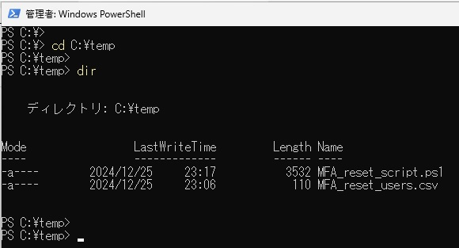

> [!NOTE]
> 本記事は 2022 年に公開した [多要素認証 (MFA) のリセット手順 - 2022 年版](../azure-active-directory/mfa-reset-2022.md) の内容を更新したものです。

# 多要素認証 (MFA) のリセット手順 - 2025 年版

こんにちは、Azure & Identity サポート チームの長谷川です。

弊社ブログでは過去に複数回にわたり、ユーザーに登録された MFA の認証方法を管理者によりリセットする手順を紹介していました。ここでのリセットとは、ユーザーに登録された MFA 用の認証方法を削除し、次回のユーザーのサインイン時に MFA が要求されると、ユーザーに MFA 用の認証方法の登録が要求されるというものです。しかしながら、現在では 2022 年版から GUI やコマンドなどが変更になったため、2025 年版として本記事を紹介します。本記事はテナントの管理者向けの記事となっております点を、あらかじめご承知おきください。

なお、一般ユーザーの権限では他ユーザーの MFA 用の認証方法をリセットすることはできません。一般ユーザーは、Entra ID にログインができる状態であればユーザー自身で自らの MFA の認証方法を変更可能です。しかし、MFA (追加の認証) を受け取れるスマートフォンを紛失したなどの場合に、ユーザーが自ら MFA 設定のリセットを行うことはできません。

## Microsoft Entra 管理センターで MFA 用の認証方法をリセットする手順

Azure ポータルでもほぼ同様の手順でユーザーに登録された MFA 用の認証方法をリセット可能です。この手順では、1 ユーザーごとに画面から MFA 用の認証方法をリセットします。

1. 認証管理者、特権認証管理者、グローバル管理者のいずれかのロールを持つユーザーで Microsoft Entra 管理センター (https://entra.microsoft.com) へサインインします (リセット対象のアカウントが管理者権限を持つアカウントの場合は特権認証管理者またはグローバル管理者にてサインインが必要です)。

2. [ユーザー] > [すべてのユーザー] に移動します。

3. ユーザーの一覧から、MFA 用の認証方法をリセットしたいユーザーの表示名を選択して開きます。

4. 画面左側のメニューから [認証方法] タブを選択します。

    

5. [多要素認証の再登録を要求する] を押下します。

    

## コマンド (Microsoft Graph PowerShell) で MFA 用の認証方法をリセットする手順 (複数ユーザーに対して一括実施)

Microsoft Graph PowerShell のスクリプトと CSV を利用して、複数ユーザーに対して設定済みの MFA 用の認証方法を一括で削除する手順です。このスクリプトでは、GUI (Azure Portal および Microsoft Entra 管理センター) で [多要素認証の再登録を要求する] のボタンを押下したときに削除される「電話番号、Microsoft Authenticator アプリ、ソフトウェア OATH トークン」を削除します。「電話番号、Microsoft Authenticator アプリ、ソフトウェア OATH トークン」以外の認証方法 (例: FIDO2 セキュリティ キー) は、この手順では削除されません。

1. MFA 用の認証方法をすべて削除 (リセット) したいユーザーの UPN を記載した CSV を作成し、MFA_reset_users.csv という名前で任意の場所に保存します。(この例では C:\temp に保存したとします)

2. CSV の中身は、項目名に "UserPrincipalName" を記載し、その後の行にユーザーの UPN を列挙します (下図参照)。

    

3. 以下の内容をコピーし、MFA_reset_script.ps1 の名前で任意の場所に保存します (この例では C:\temp に保存したとします)。もし手順 1 で CSV の保存先を C:\temp 以外にした場合は、1 行目の CSV のファイル パスを変更ください。

    ```powerShell
    $users = Import-Csv -Path "C:\temp\MFA_reset_users.csv"

    foreach ($user in $users) {
        $userId = $user.UserPrincipalName
        function DeleteAuthMethod($uid, $method){
            switch ($method.AdditionalProperties['@odata.type']) {
                '#microsoft.graph.microsoftAuthenticatorAuthenticationMethod' { 
                    Write-Host 'Removing microsoftAuthenticatorAuthenticationMethod'
                    Remove-MgUserAuthenticationMicrosoftAuthenticatorMethod -UserId $uid -MicrosoftAuthenticatorAuthenticationMethodId $method.Id
                }
                '#microsoft.graph.phoneAuthenticationMethod' { 
                    Write-Host 'Removing phoneAuthenticationMethod'
                    Remove-MgUserAuthenticationPhoneMethod -UserId $uid -PhoneAuthenticationMethodId $method.Id
                }
                '#microsoft.graph.softwareOathAuthenticationMethod' { 
                    Write-Host 'Removing softwareOathAuthenticationMethod'
                    Remove-MgUserAuthenticationSoftwareOathMethod -UserId $uid -SoftwareOathAuthenticationMethodId $method.Id
                }
                Default {
                    Write-Host 'This script does not handle removing this auth method type: ' + $method.AdditionalProperties['@odata.type']
                }
            }
            return $? # Return true if no error and false if there is an error
        }

        $methods = Get-MgUserAuthenticationMethod -UserId $userId
        # -1 to account for passwordAuthenticationMethod
        Write-Host "Found $($methods.Length - 1) auth method(s) for $userId"

        $defaultMethod = $null
        foreach ($authMethod in $methods) {
            $deleted = DeleteAuthMethod -uid $userId -method $authMethod
            if(!$deleted){
                # We need to use the error to identify and delete the default method.
                $defaultMethod = $authMethod
            }
        }

        # Graph API does not support reading default method of a user.
        # Plus default method can only be deleted when it is the only (last) auth method for a user.
        # We need to use the error to identify and delete the default method.
        if($null -ne $defaultMethod){
            Write-Host "Removing default auth method"
            $result = DeleteAuthMethod -uid $userId -method $defaultMethod
        }
    
        Write-Host "Re-checking auth methods..."
        $methods = Get-MgUserAuthenticationMethod -UserId $userId

        # -1 to account for passwordAuthenticationMethod
        Write-Host "Found $($methods.Length - 1) auth method(s) for $userId"
    }
    ```

4. 作業端末で PowerShell を管理者権限で起動します。

5. 以下のコマンドを実行しその PowerShell ウインドウ上でスクリプトを実行できるようにします。

    ```PowerShell
    Set-ExecutionPolicy RemoteSigned -Scope Process
    ```

6. 以下のコマンドを実行し、Microsoft Graph PowerShell モジュールをインストールします (既にモジュールがインストールされている場合はスキップください)。「今すぐ PowerShellGet で NuGet プロバイダーをインストールしてインポートしますか?」が表示されたら Y (はい) を選択します。

    ```powerShell
    Install-Module Microsoft.Graph -Force
    ```

7. 以下のコマンドを実行し、グローバル管理者でサインインします ([要求されているアクセス許可] という画面が表示された場合は、[承諾] を押下します)。もしグローバル管理者を利用しない場合は、実行するユーザーに二つのロール (クラウド アプリケーション管理者と (特権) 認証管理者) が付与されていれば実行可能です。管理者ユーザーの MFA の認証方法を削除する場合は特権認証管理者ロールが必要です。

    ```powerShell
    Connect-MgGraph -Scopes "UserAuthenticationMethod.ReadWrite.All" 
    ```

8. スクリプトと CSV が保存されたフォルダに移動し、CSV と スクリプトが存在することを確認しておきます。

    ```PowerShell
    cd C:\temp
    dir
    ```

    

9. 以下のコマンドでスクリプトを実行し、CSV に書かれた対象ユーザーの MFA 用の認証方法をリセットします。

    ```PowerShell
    .\MFA_reset_script.ps1
    ```

10. 削除された認証方法が Removing ... のメッセージで表示されます。

    

11. 作業が終わりましたら、以下のコマンドを実行し、セッションを切断します。

    ```PowerShell
    Disconnect-MgGraph
    ```

## 免責事項

本サンプル コードおよび手順は、あくまでも説明のためのサンプルとして提供されるものであり、製品の実運用環境で使用されることを前提に提供されるものではありません。本サンプル コードおよびそれに関連するあらゆる情報は、「現状のまま」で提供されるものであり、商品性や特定の目的への適合性に関する黙示の保証も含め、明示・黙示を問わずいかなる保証も付されるものではありません。マイクロソフトは、お客様に対し、本サンプル コードを使用および改変するための非排他的かつ無償の権利ならびに本サンプル コードをオブジェクト コードの形式で複製および頒布するための非排他的かつ無償の権利を許諾します。

但し、お客様は以下の 3 点に同意するものとします。

1. 本サンプル コードが組み込まれたお客様のソフトウェア製品のマーケティングのためにマイクロソフトの会社名、ロゴまたは商標を用いないこと
2. 本サンプル コードが組み込まれたお客様のソフトウェア製品に有効な著作権表示をすること
3. 本サンプル コードの使用または頒布から生じるあらゆる損害（弁護士費用を含む）に関する請求または訴訟について、マイクロソフトおよびマイクロソフトの取引業者に対し補償し、損害を与えないこと

## おわりに

新年のご挨拶の代わりに 2025 年版の MFA の認証方法のリセット方法を紹介しました。新しい年が皆様にとって幸多き一年となりますようにお祈り申し上げます。製品動作に関する正式な見解や回答については、お客様環境などを十分に把握したうえでサポート部門より提供しますので、ぜひ弊社サポート サービスをご利用ください。
